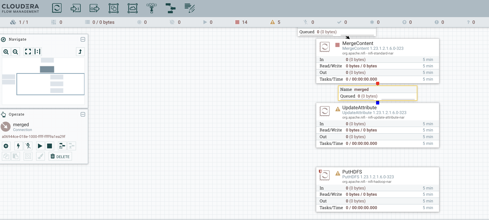
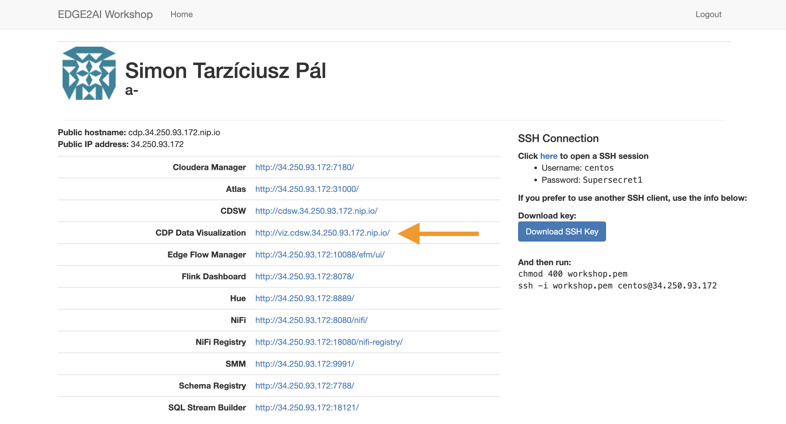
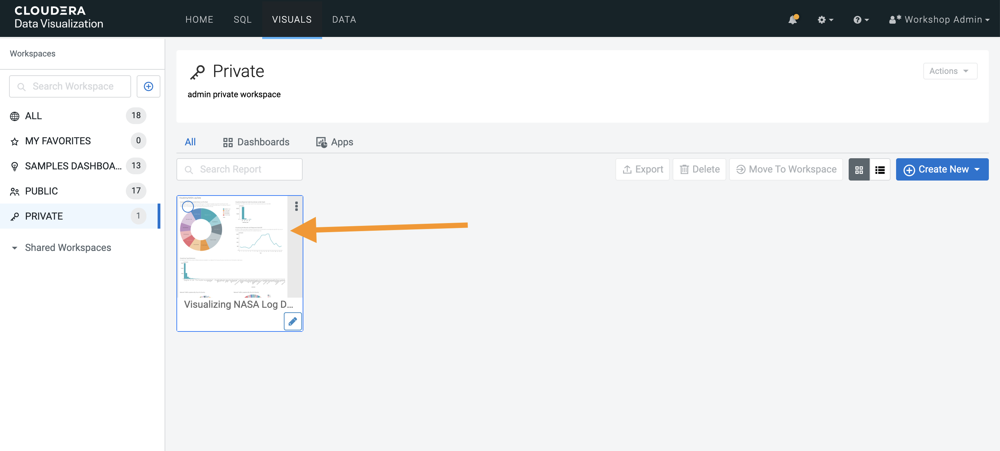

= NASA Server Log Analytics application

== Introduction
Security breaches happen. And when they do, your server logs may be your best line of defense. We take the server-log analysis to the next level by speeding and improving security forensics and providing a low cost platform to show compliance. The dataset which we are going to use in this demo is of NASA-HTTP. It has HTTP requests to the NASA Kennedy Space Center WWW server in Florida. 

During this workshop you will get familiar with basic *csv processing in NiFi*, the *Cloudera Private Cloud Base solution*, you will also convert the data to json and *store it in Kafka* which is a powerful parallelized messaging queue allowing faster analytics and resilience. You are going to run also *data engineering jobs and persist the data in Hive* after the successful ingestion and enrichment and *create a stunning dashboard* to gather insights from the data. 

=== Before you start
. Everything is Case-Sensitive.
. Check all your connections and spellings through the workshop

=== Pre-requisites

* Laptop with a supported OS (Windows 7 not supported).
* A modern browser like Google Chrome or Firefox (IE not supported).
* Go to the https://github.com/simontarzi/nasa-log-demo and download the contect by clicking on the following icons and decompress the file on your machine. We are going to use some of the files. 
+

=== Connecting to your cluster

. *Please open the IP in your browser (shown on the main screen) and finish the registration! Use the registration code shown on the main screen* 

. You will be asked to modify the password, *this password will be only used to access this registration site* if you accidentally close it. In this case use *Login* on this site. 

. This registration process will open the firewall to your specific IP and assign you to one of the cluster nodes automatically. *Take note of your cluster ip address to avoid any further issues* 

. On the web portal click on Cloudera Manager, login to *Cloudera Manager* and familiarize yourself with the services installed. Below a screenshot of Chrome open with the main page after the registration, to open Cloudera Manager click on the following. 
+
image::images/openclouderamanager.png[width=800]

. On the Cloudera Manager UI, enter the password for the Cloudera Services: 
+

. When you succesfuly logged in you will see the components of the cluster and current health, also you can manage your cluster setup from this single control pane: 

NOTE: During the workshop *you will not use the previously selected password on the registration web page*, please *copy the username and password shown on the main screen* for the Cloudera Services. 

NOTE: The credentials are case sensitive, the password has capital "S". 

NOTE: The necessary files have been preloaded to the machine which is running the Cloudera Private Cloud Base one node cluster to the /nasademo/NASALogs/NASA_access_log_Aug95. We could also use minifi agents on the servers to collect and also prepare the raw log files and then send it to nifi, however in this short workshop the intention is to showcase the capabilities of nifi and creating a dashboard to gather insights, logs collection from edge devices is not part of this session. 

= WORKSHOP START
[[lab_1, Lab 1]]
== Lab 1 - Open SMM, the management center for Kafka and create the topic *logs* where we will later put our data. 

. For this first go to the main webpage and click on *SMM*. 
+

. This is the management page for Kafka, you can view the state of the kafka topics and see the settings&details of the current cluster. 

. Now we will create our first topic, click on the topics on the left side: 
+

. Click on *Add new* 
+

. Add *logs* as topic name, select *1* for partitions, select *low* availability, and cleanup policy should be *delete*
+

. Now we can leave the SMM UI, we will come back later to check the data in Kafka. 

[[lab_2, Lab 2]]
== Lab 2 - Opening the NiFi and configure the first Processor and upload a Process Group

. On the main page, select the URL for the NiFi Service (Not NiFi Registry) 

+

. On the NiFi main page you will see the main canvas. This are is for creating your pipeline to ingest, enrich, transform load your data. Nifi is using Flowfiles and Processors to achieve this. In this workshop we are going to use the powerful built in processors. 
+

. On the main page, it is advised to separate different flows from each other, therefore we will crate a *Process Group* and we will work in that during the workshop. *Click on a Process Group icon on the top and drag the Process Group to the middle of the canvas* 

+

. A dialog box will open and add the following name for the Process Group, and click on *Add*. 
+
[source,yaml]
----
Process Group Name: AcquireNASAServerLogs
----
+

. You will see the following Process Group appearing on the screen, this will separate our flow. First right-click on the group and select *Configure*. 
+

. Select the *Controller Services* tab on the top and the *+* sign on the right. 
+

. Search for *HortonworksSchemaRegistry* and click *Add*. 

. You will see the following picture, click on the *wheel*. 
+

. Now in the *Schema Registry URL* put your ip according to the picture: *http://cdp.YOURIP.nip.io:7788/api/v1* and click *Apply*. 
+

. Now click on the small *Lightning icon* to enable it, and than click again on the *+* sign to add more services and select *JsonRecordSetWriter*. 
+

. Again click on the *wheel* for *JsonRecordSetWriter*
+

. Set the *Schema Write Strategy* to *Do Not Write Schema* and the *Schema Access Strategy* Property to *Inherit Record Schema* and click *Apply*. 
+

. Click on the *Lightning icon* on the *JsonRecordSetWriter* to enable it, and again add a new controller service with the *+* sign, search for: *JsonTreeReader*

. Set the *Schema Access Strategy* to *Infer schema* and click *Apply*. 
+

. Make sure all the controller services are enabled and similar like on this screenshot: 
+

. Now double click on the Process Group to open it. 
+

NOTE: You could also see the NiFi Registry but it's not required for now. It is a solution that enables versioning and publishing flows to NiFi, in a Production environemnt it is advised to keep track of the different versions of flows and providing solution to connect to test/dev environments and deploy after QA on PROD.) 

. In the Process Group select the *Pocessor* on the top menu and drag it to the canvas. 

+

. On the dialog box look for the processor named: *GetFile* and click *Add*. 

+

. Right click on the processor and select *Configure* from the list. Perform the following changes: 
+
[source,yaml]
----
Settings tab
Name: GrabNASALogs

Schedule tab
Run Schedule: 60 sec

Properties tab
Input Directory: /nasademo/NASALogs/
Keep Source File: true
----
+

. Now select the *Process Group* from the top and drag it to the canvas, on the newly opened dialog click ont the following button and browse for the *Split_to_lines&enrich* file that you have downlaoded in the beginning from github: 
+
image::images/nifi8.png[width=800]

. Click "Add" and you will see the new Group, you can open it and observe the processors what are they actually doing. They are intended to split the CSV to individual line and perform modifications. 
+

. You can go back to our Process Group with the navigation bar in the bottom:
+

. Now connect the *GrabNASALogs* processor to the *Split_to_lines&enrich* processor, by dragging the symbol in the middle of the *GrabNASALogs* processor (when you move your mouse it will appear) and drag it to the *Split* processor. 
+

. Acknowledge the dialog windows, and you need to see the following: 
+
image::images/nifi14.png[width=800]

NOTE: The *Split_to_lines&enrich* Process Group is connected to the external Process Group with input and output ports, you can check it if you click on the connection between the processors. 

[[lab_3, Lab 3]]
== Lab 3 - Creating the flow to archive data to HDFS

NOTE: At this point after the Splitting Process group we receive lines, (in later steps we will check it), and we need to merge it again and store it in the proper format to archive it on HDFS. 

. As a first step, we are going to merge the lines together, for this drag the *MergeContent* Processor to the canvas like in the previous steps

. Right click on the MergeContent Processor and select *Configure* and add the following configuration to the following records: 
+
[source,yaml]
----
Properties tab
Minimum number of Entries: 20
Maximum number of Entries: 40
Maximum number of Bins: 40
Delimiter Strategy: Text

Relationships tab
Failure: Terminate - check
Original: Terminate - check
----
+

. Click on *Apply*, and now connect the *Split_to_lines&enrich* Process Group to the *MergeContent* processor, select "output" as the output and click on *ADD*. 

. Add a new Processor to the canvas, select *UpdateAttribute*. You should see the following: 
+

. Right click on the *UpdateAttribute* processor and select *Configure*. On the Properties tab click on the *+* sign on the left and add the following custom property: 
+
[source,yaml]
----
Property: filename
Value: logsample-${now):format("HHmmssSSS")}-${UUIDO}.txt
----
+

. Connect the UpdateAttribute processor and the MergeContent Processor together, in the dialog box select *For relationships* to *merged* and click *ADD*. 
+
image::images/nifi19.png[width=800]

. Now add a PutHDFS processor to the canvas, you need to see the following: 
+

. Right click on PutHDFS and select *Configure* and set the following parameters: 
+
[source,yaml]
----
Properties tab
Hadoop configuration resources: /etc/hadoop/conf/core-site.xml,/etc/hadoop/conf/hdfs-site.xml
Directory: /nifi

Relationships tab
Failure: terminate
Success: terminate
Failure: terminate
Success: terminate
----
+

. Connect the *UpdateAttribute* and *PutHDFS* processor, in the dialog box select *For relationships* to *success* and click *ADD*.

. Congratulations, you are done with this part, the flow actually creates the proper txt files with names and put it to the hdfs /nifi folder. 

[[lab_4, Lab 4]]
== Lab 4 - Store the data in Kafka

NOTE: We are currently representing log data as one row, and just merged them to files to be able to store it on hdfs. However for Kafka we need to transform this data into a proper format. We are going to perform it in the easiest way with only one processor. 

. As a first step, add the *ExtractGrok* processor to the canvas. 
+

. Right click on the *ExtractGrok* and select *Configure* and set the following parameters: 
+
[source,yaml]
----
Properties tab
Grok Expression: %{IP:ip_address}\|%{HTTPDATE:timestamp}\|%{WORD:request_method} %{URIPATH:request_uri} HTTP/%{NUMBER:http_version}\|%{NUMBER:status_code}\|%{WORD:city}\|%{WORD:country}\|%{WORD:country_code}\|%{NUMBER:latitude}\|%{NUMBER:longitude}
Destination: flowfile-content

Relationships tab 
unmatched: terminate

----
+

. Connect the *Split_to_lines&enrich* Process Group to the *ExtractGrok* processor, select "output" as the output and click on *ADD*. 

. Add another processor to the canvas, select *PublishKafkaRecord_2_61.23.12.1.6.0-323*, important to select this version, we also have PublishKafka and PublishKafkaRecord processors with different versions, you need to see the following screen:
+

. Right click on the *PublishKafkaRecord_2_61.23.12.1.6.0-323* and select *Configure* and set the following parameters: 
+
[source,yaml]
----
Properties tab
Kafka broker: cdp.YOURIP.nip.io:9092
Topic name: logs
Record Reader: JsonTreeReader
Record Writer: JsonRecordSetWriter
Use transactions: false

Relationships tab 
Failure: terminate
Success: terminate
----
+

. Conect the *ExtractGrok* and the *PublishKafkaRecord_2_61.23.12.1.6.0-323* processor and select For relationships *matched* in the dialog box. 

. Go back to the main Process group *AcquireNASAServerLogs*, right click on the ProcessGroup and select *Start*. 
+

* At this point the flow should start, open the ProcessGroups and * observe how the data flows through our flow. 

* You can also right click on the connections between certain processors, go to the connection between ExtractGrok and PublishKafkaRecord, *right-click on it*, select *List queue*. 
+

* Cick on the *eye* and observe the output. 
+

* Go back to the SMM, open *Topics* and search for *logs* topic that we just created, click on the *magnifier icon* to see the data in the kafka topic. 
+

. If you have checked that the data is coming to the topic, *AFTER 5 MINUTES STOP THE FLOW, OTHERWISE IT WILL FILL UP THE MACHINE'S STORAGE SPACE* 

[[lab_4, Lab 4]]
== Lab 4 - Use Zeppelin to transfor and load data to Hive tables

. We will run some basic data negineering jobs to create Hive tables and perform some modifications to the data to prepare it for visualization. 

. Locate *Zeppelin* in the Cloudera manager UI, click on it. 
+

. Click on the *Zeppelin WEB server UI*
+

. On the top right corner hit *Login* and add user user and password. 

. Now on the Zeppelin main page click on *Import note* and click on *Select JSON file* and locate the *Cleaning-Raw-NASA-Log-Data.json* file and upload it, open the *Cleaning-Raw-NASA-Log-Data* note. 
+

. Click on the *Run All Paragraph* and observe how it executes the code. 
+

. Make sure to check that every paragraph has been finished! 

. We are done with this part, the data has been loaded to Hive tables and now ready for analytics. 

[[lab_5, Lab 5]]
== Lab 5 - Loading visualiztion to DataViz 

. Now go to the web UI again and look for *CDP Data Visualization* and open it. 
+

. Login with the credentials. 

. Click on *New connection* at the top left of the UI
+

** Select *Impala* as connection Type
** Name the connection as *Impala*

** On the *Basic* tab add your hostname, and port: 21050
+
image::images/lab10_dviz2_conn.png[width=800]

** On the *Advanced* tab select: 
*** Connection mode: Binary
*** Socket type: Normal
*** Authentication mode: NoSasl
** Hit *Test* and after connection is verified click on *Connect* 
+

In this lab we are going to import a previously created dahsboard to the Cloudera DataViz tool to visualize webserver logs. Later on if you have time try to add more queries and visualizations to the dashboard, exploring the dataset and the possibilities of this tool. 

. On the Dataviz UI select the *DATA* from the top bar
. On the left pane select the previously created *Impala* connection
. Under the top bar, you can see the "New Dataset", "Add Data" row and there are three dots at the end of the row, click on the *three dots* and select *Import Visual Artifacts*

+

. Upload the previously downloaded *Visualizing NASA Log Data.json* on the UI (you can also drag&drop) and untick the *Check data table compatibility* checkbox and select *Import*. 
+

. On the next page hit *ACCEPT AND IMPORT*.
+

. On the top select *Visuals* and select the *Visualizing NASA Log demo* visual. 
+

. Explore the dashboard

[[lab_6, Lab 6]]
== Lab 6 - Bonus Lab for exploring DataViz 

In this lab the screenshots are from a different visualization, so you can not follow the instructions, you have to adapt the setting the this specific dataset :)

. If you would like to add visuals and try querying the data click *Edit* 
+
image::images/cdv5.png[width=800]

. The orange arrow represents the dashboard level functions, with the first icon you can add visuals to the existing dashboard, try it. 

+
image::images/cdv6.png[width=300]

. Select the data which you would like to explore and click on *New Visual*

+

. On the top you can select the type of visual what you would like to use
. On the right pane you can see the *Dimensions* and drag them to the *Visuals* box right next to it to the *Dimensions* fields. You can do the same with the *Measures* and if you would like to add properties, just click on the added *Dimensions* or *Measures* and on the right *Field Properties* will open where you can choose. 

+
image::images/cdv8.png[width=800]

*Thanks for the participation in the workshop!* 

